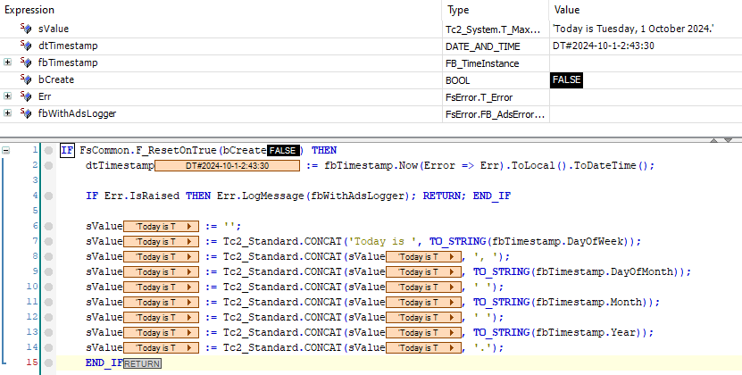

# FisoThemes' Time Library for TwinCAT

## Overview

A library that provides a robust set of tools for managing time-related operations in TwinCAT applications. This library enhances the capabilities of automation projects by offering utilities for precise tracking of time intervals, elapsed time measurement, and complex time calculations. It also includes a variety of types and methods that facilitate interactions with different time formats, simplifying time management and operations.

## Features

- **Time Interval Management:** Offers function blocks for managing specific time intervals, including start, stop, and expiration functionalities.

- **Elapsed Time Measurement:** Facilitates accurate measurement of elapsed time with intuitive methods for starting, stopping, and resetting timers.

- **Time Representation:** Provides functionality to represent specific points in time and perform calculations on time spans.

- **Conversion Methods:** Includes methods for converting between various time units (e.g., seconds, minutes, hours, days) for easy time manipulation.

## Dependencies

FsGenerics depends on the following libraries:
- **[FsCommon](https://github.com/fisothemes/FisoThemes-Common-Library-for-TwinCAT) :** Provides common data structures and utilities.
- **[FsError](https://github.com/fisothemes/FisoThemes-Error-Library-for-TwinCAT) :** Manages error handling and error code definitions.

## Usage

The library includes several function blocks that can be integrated into TwinCAT projects for effective time handling. Below are examples of typical usage scenarios:

### Example 1: Creating a Formatted Timestamp String
```js
VAR 
    sValue          : Tc2_System.T_MaxString;
    dtTimestamp     : DT;
    fbTimestamp     : FsTime.FB_TimeInstance;
    bCreate         : BOOL := TRUE;
    Err             : FsError.T_Error;
    fbWithAdsLogger : FsError.FB_AdsErrorLogger;
END_VAR


IF FsCommon.F_ResetOnTrue(bCreate) THEN
    // Get the current local time.
    dtTimestamp := fbTimestamp.Now(Error => Err).ToLocal().ToDateTime();

    IF Err.IsRaised THEN Err.LogMessage(fbWithAdsLogger); RETURN; END_IF

    // Create a formatted timestamp string.
    sValue := Tc2_Standard.CONCAT('Today is ', TO_STRING(fbTimestamp.DayOfWeek));
    sValue := Tc2_Standard.CONCAT(sValue, ', ');
    sValue := Tc2_Standard.CONCAT(sValue, TO_STRING(fbTimestamp.DayOfMonth));
    sValue := Tc2_Standard.CONCAT(sValue, ' ');
    sValue := Tc2_Standard.CONCAT(sValue, TO_STRING(fbTimestamp.Month));
    sValue := Tc2_Standard.CONCAT(sValue, ' '); 
    sValue := Tc2_Standard.CONCAT(sValue, TO_STRING(fbTimestamp.Year));
    sValue := Tc2_Standard.CONCAT(sValue, '.');
    END_IF

// sValue Output: 'Today is Tuesday, 1 October 2024.'
```


### Example 2: Executing a Task at a Regular Interval

Create a function block that implements `I_TimeElapsedCallback`.

```js
// A data logger that captures and logs pressure
// readings at each specified interval.
FUNCTION_BLOCK FB_DataLoggerCallback IMPLEMENTS I_TimeElapsedCallback
VAR_INPUT
    fPressure   AT %I*  : REAL;
    ipBuffer            : FsCollections.I_List;
END_VAR
VAR
    _fbWithAdsLogger    : FsError.FB_AdsErrorLogger;
END_VAR

// Called when the timing source reaches the specified interval.
METHOD OnTimeElapsed
VAR_INPUT
    ipSource : I_TimingSource; // The timing source triggering the event.
END_VAR
VAR
    Err : FsError.T_Error;
END_VAR

THIS^.ipBuffer.Append(fPressure, Error => Err);

IF Err.IsRaised THEN 
    Err.LogMessage(THIS^._fbWithAdsLogger);
    END_IF

END_METHOD
```

Register the function block with an interval timer.

```js
VAR
     // Sampling period for data logging.
    tSamplingPeriod  : LTIME := LTIME#10S; 
    tElapsedTime     : LTIME;
    nIntervalCount   : UINT; 
    bStart           : BOOL := TRUE;
    bStop            : BOOL; 
    fbIntervalTimer  : FB_IntervalTimer;
    fbDataLogger     : FB_DataLoggerCallback;
    fbBuffer         : FsCollections.FB_ArrayList;
END_VAR

fbDataLogger(ipBuffer := fbBuffer);
IF FsCommon.F_ResetOnTrue(bStart) THEN
    // Set the desired interval for the timer.
    fbIntervalTimer.IntervalTime := tSamplingPeriod;

     // Assign the callback and start the interval timer.
    fbIntervalTimer
        .SetCallback(fbDataLogger)
        .Start();
    END_IF

IF FsCommon.F_ResetOnTrue(bStop) THEN
    fbIntervalTimer.Stop();
    END_IF

nIntervalCount  := fbIntervalTimer.Run().IntervalCount;
tElapsedTime    := fbIntervalTimer.ElapsedTime;
```

### Example 3: Extracting the Components of a Time Span 

```js
VAR
    fbTimeSpan  : FB_TimeSpan;
    Mins        : T_Minute;
    nTotalMins  : ULINT;
END_VAR

// Extract the minute component from a time span.
// Output: 30
Mins := fbTimeSpan.FromTime(LTIME#100D2H30M40S500MS600US700NS).Minute;

// The total number of minutes in the time span.
// Output: 144150
nTotalMins := fbTimeSpan.ToMinutes();
```

## Developer Notes
This project is still in development. There's a lot of work and testing ahead. Changes to functionality may occur in the future.

This is designed to be part of a larger framework that is still under development.